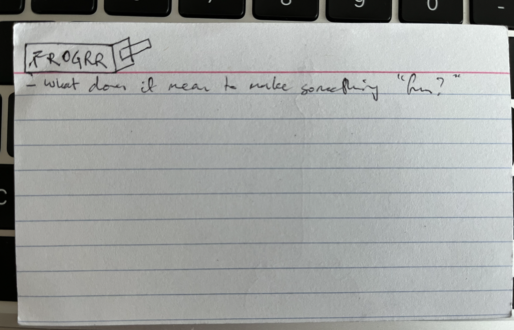

# Journal

## Beginning -- Wednesday, 10 July 2024

This project kind of stems from this index card:

I met up with Jim Munroe in Mile End just before we left for NYC (where I'm writing this in Harlem on 122nd) and was talking to him about how I've tended to feel, almost since getting the job at Concordia (a "real job") that I've increasingly felt obliged to think in terms of research and "serious" work with my games, such that... well I still really enjoy that kind of work, but there's a bit of a hole where the fun (for me) should be? If I go back through the work I've done since 2015 a huge percentage of it is about very formal variations (often that's pretty fun, but it's also very intellectualized - maybe I can't help that), or about exhibiting technical properties of games (v r stuff). 

Which is not *bad*, but it feels like there's been a kind of break between previously making games I simply found *funny* and maybe thought of as interesting or "profound" later on, and now making games where I'm *trying* to make sure the interesting bit is baked in and pursued and contemplated from the beginning. MDM doesn't "help" with this because it's a serious encouragement to be elevating design to the conscious level and, I think, in writing about it you tend to want or need the design work itself to be very conscious and considered, which perhaps leads to it being drier. (Again, not a bad thing, and it's a good kind of design that I love.)

So a part of the idea behind the "poppies" index card above was to pursue something more arranged around fun, a smaller scale, less of an overt thinky experience. 

Then, as it happened, I was wanting a miniproject to show my programming students at the halfway point of the course... to kind of demonstrate the ways in which you can have ideas, how you can plan them, and how you can implement them. And in the interest of having a destination already in mind (so that my demonstration wouldn't be too full of ums and dead ends) I very quickly implemented what I thought might be the "simplest" thing I could do.

And, well, I made a tiny game of a frog eating flies - or is it a simulation given there are no points or win conditions? As I got it working and even kept stripping it back (from keyboard controls to mouse controls for instance), I kept finding myself playing it for longer than necessary. That "one more fly" feeling. And that... really surprised me, because it's not really a feature of my work for me to want to play... almost anything I've made? They're ideas rather than fun fun fun (but hey Robert I *still* think they have to be made to be understood).

It's a very simple interaction - press and hold to shoot out a tongue a certain distance, move the frog with the mouse. As I said, it was written as an example of a "total" program for my programming course in the Fall (uses instructions, functions, variables, conditionals, and events). And mostly I just find it encouraging and surprising that something made out of that *little* of the world of programming can still *be something*.

And at some point I asked myself: well, couldn't I just make this frog game my next project? And so then the index cards roll in as I try to think about the implications of that, written in both Montréal and in NYC now:

Most of the thinking here is still essentially where I'm at, which is most significantly asking: well, what is this? And what do I do? And it feels like I'm again always at risk of overintellectualizing/academifying:

> Is this ultimately about exploring what's *fun*? 

Which is almost hilariously basic and almost (or maybe not even just almost) embarrassing. In a way this is the crux of it for me - I'm at some very real level kind of scared of the idea of fun because I'm inexperienced at designing for it, and it feels like you can really get *judged* over it in a way I suppose I would care about it. But why would I care about it *really*?

So, yeah, this is at some basic level about *fun* or maybe about "juice"? Some constellation of mechanics and ideas and seeing how they impact the experience of an incredibly basic underlying game (Poppy), like Pong with screenshake etc. Cowbell.

And I don't know if I can really, really resist the idea of making this into a game where I'm inviting the player into thinking about what the differences between versions of the game make? Like sound/no-sound, screen-shake or not, etc. etc.

And so perhaps there's a question of how much to lean into that even? Like you could go all snootysnoot with interstitial meditations of different elements of game design? Or you could group different variations based on attention to a specific element of design? Like little families of what-ifs?

And lurking in here somewhere is the question of whether you can or should do something where you can activate sets of mechanics to create different experiences... finding the categorical/taxonomic elements of the game and then varying within those. Fly movement, frog movement, tongue movement, blah blah blah forever.

Does that become fatiguing? Does it need curation? (The interstitials start to look not so stupid?) Is it just a cacophony at some point?

And along the same lines how do *I* implement such a game? Do I need to know this meta stuff or can I build it without? Do I need OOP to make this actually work with my classic inheritance idea? Is a component system actually smarter? That's brain stretchy for me. Can you componentize even without OOP but just with functional programming? Probably the answer is yes even.

Is breaking the game into a system of components kind of neat? Essentially a set of functions that can be played around with to generate different versions of the game?

Is my starting point a taxonomization? Probably. God that's so me. Let's taxonomize the fun.

Hey here's a fucking question: should I read, like, game design books as an important starting point for such a taxonomization? E.g.

- Schell's book of lenses
- Swink's game feel
- And blah blah blah all the way back to Crawford?

As I type this it's obvious that's what I should and will do, which will be fun! Like a straight up, no fucking around, application of game design wisdom to a game?

At what point does that start to be, like, weirdly uninteresting? More of a personal project? Is there a *CONTRIBUTION TO KNOWLEDGE* in here anywhere? Do I give a shit?

HMMMM. There's actuall more thinking to do here I think. But next steps:

- Read some game design texts
- Write out some initial taxonomizing thoughts (separate file?)

Should this be the project I start with memoing? I feel like that would be really cool if I could grab onto it....?

Anyway let me stop rambling and do something.